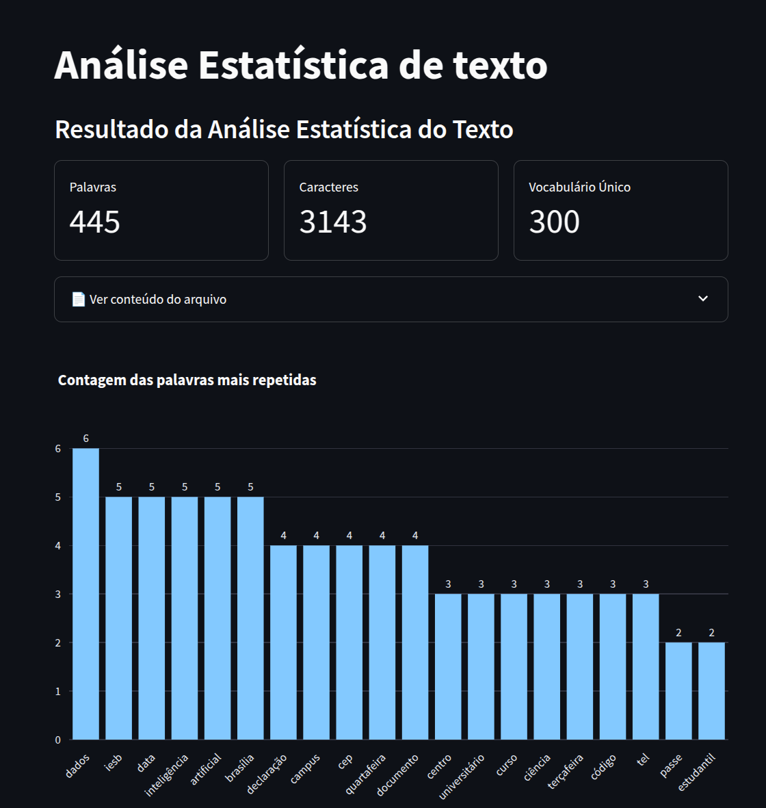

# Análise Estatística de Dados Textuais - NLP - Streamlit
 Autor: Felipe Toledo
Foi desenvolvida uma aplicação no streamlit apresentando uma análise estatística de texto para a disciplina de Tópicos em NLP, do curso de graduação em Ciência de Dados e Inteligência Artificial do IESB.

Acesse a aplicação [aqui](https://statstext-fixtqgab9r597uhfembw6o.streamlit.app/ "aqui")

------------

## Utilidades
- Leitura de arquivos: .txt, .docx, .pdf
- Caixa de texto livre
- Bigramas: contagem em agrupamento de dois
- Nuvem de palavras: gráfico com as palavras mais repetidas em formato de nuvem